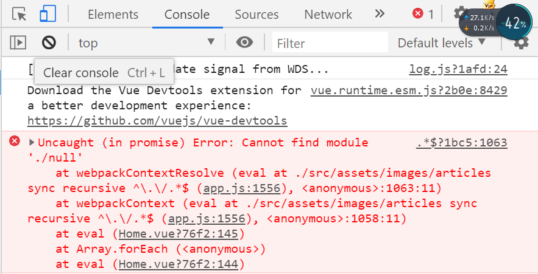
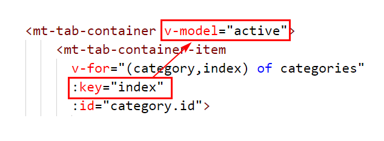
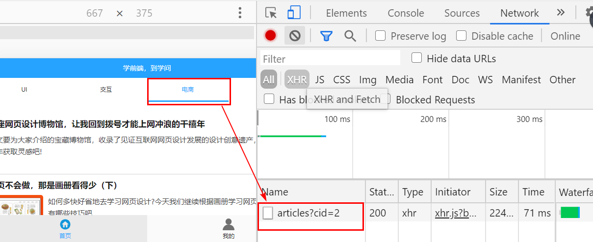
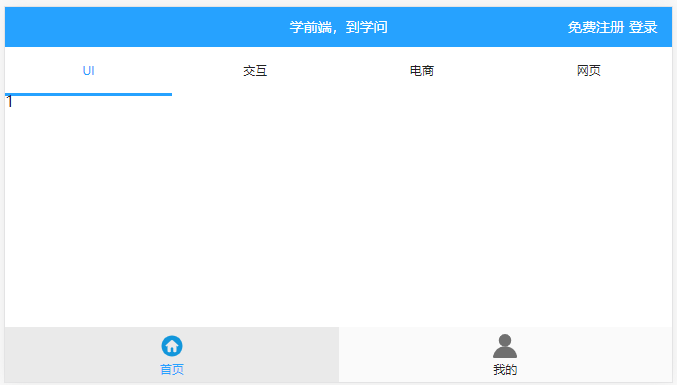
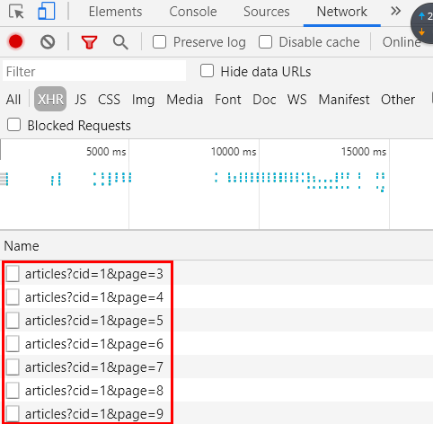
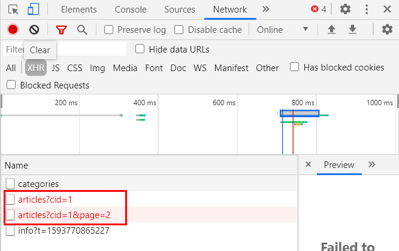

# `Vue`组件库 - `Unit05`

# 1.首页文章列表的图像

首页中的文章图像存储在数据表`xaqa_article`中，现在虽然已经从`WEB`获取到图像的路径信息，但是不能直接在页面中进行显示，需要通过`require`语句动态实现加载，示例代码如下：

```javascript

 mounted(){
    //获取全部文章数据
    this.axios.get('/articles').then(res=>{
        let data = res.data.results;
        data.forEach(item=>{
            item.image = require('../assets/images/articles/' + item.image);
        });
    });
  }
```

此时的运行结果如下图所示：



此时的错误原因是因为在`xaqa_article`数据表中`image`字段允许为空，也就是说某些记录可能不存在缩略图。所以在动态加载的时候需要进行判断才可以，示例代码如下：

```javascript

mounted(){

    //获取全部文章数据
    this.axios.get('/articles').then(res=>{
        let data = res.data.results;
        data.forEach(item=>{
            if(item.image != null){
              item.image = require('../assets/images/articles/' + item.image);
            }
            this.articles.push(item);
        });
    });
  }

```

目前已经完成了图像的动态加载，现在需要在页面中循环时动态输出图像，示例代码如下：

```html


 <!-- 图像区域开始 -->
 <div class="info-item-img" v-if="article.image != null">
 	
 </div>
 <!-- 图像区域结束 -->

```

> 说明:之所以在`<div>`元素中添加`v-if`指令是因为某些文章不存在图像

现在可以将图像使用`Mint UI`提供的懒加载实现，示例代码如下：

```html

 <!-- 图像区域开始 -->
 <div class="info-item-img" v-if="article.image != null">
 	
 </div>
 <!-- 图像区域结束 -->

```

> 数据表的存储图像时的路径问题：
>
> A.可以直接存储网络绝对路径，如`http://image.360buy.com/images/5966554.jpg`
>
> B.使用相对路径存储，但是只存储所有图像文件的不同信息即可，如
>
> 案例说明`(1)`
>
> ```shell
> 
> 假设所有的图像都存储在 src/assets/images目录下，只有图像名称不同，此时数据表的记录可写成：
> 3456356.jpg
> 4356745.png
> 
> ```
>
> 案例说明`(2)`
>
> ```shell
> 
> 假设所有的图像都存储在 src/assets/images不同目录下，此时数据表的记录可写成：
> a/3456356.jpg
> b/4356745.png
> 
> ```

# 2.实现切换顶部选项卡时面板内容随之变化

## 2.1 数据准备

1.顶部选项卡的数据来源于`xzqa_category`(文章分类)数据表

2.面板中的文章数据来源于`xzqa_article`(文章)数据表

3.在`xzqa_article`(文章)数据表中存在外键`category_id`用于标识当前文章所属的分类

4.在`MySQL`进行记录查询时的`SQL`语句结构如下：

```sql

SELECT 字段名称,... FROM 数据表名称 [WHERE 条件表达式] [LIMIT [offset,]row_count]

```

>  说明:`SQL`语句中的方括号代表可选项

## 2.1 切换顶部选项卡时的面板内容随之发生变化

在切换顶部选项卡时， `<mt-navbar>`所绑定的变量`active` 随之发生变化，其引申出的问题是：

在**切换顶部选项卡**时，要以当前被选定的选项卡的`ID`为条件在`xzqa_article`数据表中查询相关的文章数据才行。其实现在`active`绑定的变量值是`xzqa_category`数据表记录的`ID`(如图)。



刚刚强调：**在切换顶部选项卡时才获取相关的文章数据** -- 引申出怎么才知道切换了顶部的选项卡呢？ -- **`watch`实现**，测试案例代码如下：

```javascript

watch:{
	active(){
      console.log('现在要获取WEB服务器中分类ID为' + this.active  + '的文章数据了');
    }
}

```

所以现在在`active()`函数中要发送`AJAX`请求到`WEB`服务器，示例代码如下：

```javascript

watch:{
    active(){
      //获取当前分类的文章数据
      this.axios.get('/articles?cid=' + this.active);
    }
  }

```

或者是：

```javascript


watch:{
    active(){
      //获取当前分类的文章数据
      this.axios.get('/articles',{
          params:{
            cid:this.active
          }
      });
    }
  }

```

在上述代码中，之所有为`/articles` `API`接口添加`cid`参数的原因是：**期望得到当前分类下的文章数据**

此时的运行效果如下图所示：



虽然现在`AJAX`请求已经正常发送，但是回想前期封装的`articles` `API`中根本没有接收到这个`cid` 的参数，所以现在必须重新配置`WEB`服务器中`/articles`的 `API`接口：

第一步：修改`app.js`中`/articles`接口，示例代码如下：

```javascript

server.get('/articles',(req,res)=>{

    //获取URL地址栏中的参数
    let cid = req.query.cid;

    //获取xzqa_article数据表中以获取到的cid为条件的记录
    let sql = 'SELECT id,subject,description,image FROM xzqa_article WHERE category_id=?';

    //通过MySQL连接池执行SQL语句
    pool.query(sql,[cid],(err,results)=>{
      
        if(err) throw err;

        res.send({message:'查询成功',code:1,results:results})
    })
});

```

第二步：重新启动`WEB`服务器 

重新启动`WEB`服务器后，在初始及切换顶部选项的情况下都没有显示任何数据，但是同时在客户端和服务器也没有产生错误信息，如下图所示：



第三步： 在刚刚完成的客户端代码中，只是完成了发送`AJAX`请求的任务，并没有接收服务器返回的数据，所以在没有显示任何数据，故：

```javascript

watch:{
    active(){
      //获取当前分类的文章数据
      this.axios.get('/articles',{
          params:{
            cid:this.active
          }
      }).then(res=>{
          let data = res.data.results;
          data.forEach(item=>{
            if(item.image != null){
              item.image = require('../assets/images/articles/' + item.image);
            }            
            this.articles.push(item);
        });
      });
      
    }
  }

```

在运行上述代码后，尤其时第二次切换到面板时感觉数据没有发生任何的变化，根本原因是上述代码中，采用了`array`对象的`push()`方法，也就是在后续进行切换顶部选项卡时数据在添加到数组的未尾，所以感觉数据没有发生任何的变化。所以必须在切换顶部选项卡时，清空之后保存的数据，示例代码如下：

```javascript

watch:{
    active(){
      //清空之间保存的文章数据
      this.articles = [];
      //获取当前分类的文章数据
      this.axios.get('/articles',{
          params:{
            cid:this.active
          }
      }).then(res=>{
          let data = res.data.results;
          data.forEach(item=>{
            if(item.image != null){
              item.image = require('../assets/images/articles/' + item.image);
            }            
            this.articles.push(item);
        });
      });
    }
  }

```

经过上述代码可以切换选项卡时，实现面板内容的实时变化，但是，初始情况下，面板中没有显示任何的数据，截图如下：


初始情况下 -- `mounted`的代码如下：

```javascript

//获取全部文章数据
this.axios.get('/articles').then(res=>{
    let data = res.data.results;
    data.forEach(item=>{
        if(item.image != null){
            item.image = require('../assets/images/articles/' + item.image);
        }            
        this.articles.push(item);
    });
});

```

仔细查看上述代码可发现 -- 在向`/articles`接口发送请求时，没有带有`cid`参数，如果再类推一的话，`WEB`服务器此时**伪代码**的运行如下：

```javascript

server.get('/articles',(req,res)=>{
   	let cid = req.query.cid; //因为初始化时没有cid参数，故cid变量的值为undefined
    sql = 'SELECT ..... WHERE category_id=?';
    pool.query(sql,[cid],(error,results)=>{
        ....
    })
});

```

所以，必须要修改`mounted`钩子函数中发送`AJAX`请求的相关代码，示例如下：

```javascript

this.axios.get('/articles',{
    params:{
        cid:this.active
    }
}).then(res=>{
    let data = res.data.results;
    data.forEach(item=>{
        if(item.image != null){
            item.image = require('../assets/images/articles/' + item.image);
        }            
        this.articles.push(item);
    });
});

```

纵观初始情况下的`AJAX`请求和切换顶部选项卡的`AJAX`请求，会发现其代码是完全一致的，所以最好将这个过程封装为自定义函数， 这次就可以实现**一次定义，多次调用**，故：

```javascript
methods: {
    //加载数据
    loadData(){
        this.axios.get('/articles',{
            params:{
                cid:this.active
            }
        }).then(res=>{
            let data = res.data.results;
            data.forEach(item=>{
                if(item.image != null){
                    item.image = require('../assets/images/articles/' + item.image);
                }            
                this.articles.push(item);
            });
        });
    }
}
```

然后分别在`mounted`及`watch`时调用即可，示例代码如下：

```javascript

watch: {
    active() {
        //清空之间保存的文章数据
        this.articles = [];
        //获取当前分类的文章数据
        this.loadData();
    }
},
mounted() {
        //获取文章分类数据
        this.axios.get("/categories").then(res => {
            this.categories = res.data.results;
        });
        //获取当前分类的文章数据
        this.loadData();
}

```

# 3.`JS`组件 

## • `Infinite Scroll`指令

`Infinite Scroll`指令用于实现无限滚动，其语法结构是：

```html

<HTML元素 
	infinite-scroll-distance="阈值"
    v-infinite-scroll="方法名称"
    infinite-scroll-disabled="变量名称"
    :infinite-scroll-immediate-check="true">
</HTML元素>


```

> `infinite-scroll-distance`属性是指距滚动容器底部还有多少像素时触发无限滚动指令
>
> `v-infinite-scroll`属性用于指定在触发无限滚动指令后需要调用的方法/函数名称
>
> `infinite-scroll-disabled`属性为布尔类型，其作用是为了保证执行完上一次滚动函数之前，即使再次进行滚动范围也不再触发滚动函数。 
>
> `:infinite-scroll-immediate-check="true"` 

## • `Indicator`组件

`Indicator`组件用于实现加载提示框，其语法结构是：

```javascript

//打开加载提示框 -- 简写方式
this.$indicator.open("加载提示文本")

//打开加载提示框 -- 标准方式
this.$indicator.open({
    text:"加载提示文本",
    spinnerType:"加载图标类型"
})

//关闭加载提示框
this.$indicator.close()

```

> 加载图标类型有：
>
> - `snake`，蛇形
> - `double-bounce`，双弹跳
> - `triple-bounce`，三弹跳
> - `fading-circle`，渐消圆

综上组件的示例代码如下：

```html

<template>
  <div>
      <div style="background:#000;height:80px;"></div>
      <div 
        style="border:2px solid #f00;"
        infinite-scroll-distance="10"
        v-infinite-scroll="loadData"
        infinite-scroll-disabled="busy">
          <p v-for="(v,k) of i" :key="k">{{v}}</p>
      </div>
      <div style="background:#00f;height:120px;"></div>
  </div>
</template>
<script>
export default {
  data(){
    return {
      i:30,
      busy:false
    }
  },
  methods:{
    loadData(){
      this.$indicator.open({
        text:"加载中...",
        spinnerType:"fading-circle"
      });
      this.busy = true;
      //模拟假设当前WEB服务器运行速度非常慢
      window.setTimeout(()=>{
        this.i += 30;
        this.busy = false;
        this.$indicator.close();
      },10000);
    }
  }
}
</script>

```

# 4.面板数据实现无限滚动和分页技术

现在已经实现了初始化及切换顶部选项卡的情况下显示文章数据的业务了，但是由于文章数量巨大，此时会增大` WEB`服务器的请求压力，所以最好对面板的数据实现无限滚动，并且在滚动时异步加载更多的数据（其实就是采用分页技术）。

## • `MySQL`数据库分页的原理及相关的公式

利用`MySQL`数据库进行分页，实质是利用了`MySQL`数据库`SELECT`语句中的`LIMIT`子句实现，`SELECT`语句的语法结构是：

```sql

SELECT 字段名称,... FROM 数据表名称 [WHERE 条件表达式] [LIMIT [offset,]row_count]

```

> `offset`参数是从结果集中的第几条记录开始返回，从`0`开始编号，如果省略该参数则从`0`开始
>
> `row_count`参数指返回的记录数量

其中利用`SELECT`语句进行分页时，`LIMIT`子句中的`offset`参数的公式是：

```shell

(页码-1) * 每页显示的记录数

```

## • 面板数据实现无限滚动和分页技术

在初始化获取`WEB`服务器数据时，当前页码初始值应该为`1`，而且向下进行滚动时，页码的值应该发生累加，所以现在先必须在`data()`中声明变量用于存储当前页面初始值，而且在滚动时页码发生累加。示例代码如下：

```javascript


data() {
    return {
        //存储页码,初始值为1
        page:1
    };
 }
```

上述代码已经完成了页码变量的初始值，**但是还没有进行无限滚动指令，同时也没有产生页码的理累加！**

第一步：在相关元素添加无限滚动指令，示例代码如下：

```html

<div 
	class="panel"
   	infinite-scroll-distance="10"
    v-infinite-scroll="loadMore"
    infinite-scroll-disabled="busy">
    ...
</div>

```

此时还需要在`<script>`标签中自定义函数 -- `loadMore`，同时在`data()`方法添加`busy`的变量，初始值为`false`，示例代码如下：

```javascript
<script>
export default{
	methods:{
        //无限滚动指令需要调用的函数名称
        loadMore(){
            
        }
    },
    data(){
        return {
            //用于标识当前是否正在处理请求
            busy:false
        }
    }
}
</script>

```

第二步：另外在无限滚动时需要让当前页码变量进行累加，示例代码如下：

```javascript

<script>
export default{
	methods:{
        //无限滚动指令需要调用的函数名称
        loadMore(){
            this.page++;
            console.log('现在应该去WEB服务器加载第' + this.page + '页数据了');
        }
    },
    data(){
        return {
            //用于标识当前是否正在处理请求
            busy:false
        }
    }
}
</script>

```

第三步：上述代码只是完成了页码的累加，并没有发送`AJAX`请求，所以：

```javascript

loadMore(){
    this.page++;
    //console.log('现在应该去WEB服务器加载第' + this.page + '页数据了');
    this.axios.get('/articles',{
        params:{
            //当前分类
            cid:this.active,
            //第几页的数据
            page:this.page
        }
    })
}

```

**之所以需要传递两个参数是因为：在向下滚动时要从`WEB`服务器获取当前分类下的第几页的数据，所以既需要传递当前分类的`ID`还需要传递当前的页码！**此时的运行结果如下图所示：



现在虽然请求的过程是正确的，但是`WEB`服务器的`/articles`接口中根本接收`page`参数，也就没有进行部分记录的获取操作，所以：

第四步：修改`app.js`中`/articles`接口，示例代码如下：

```javascript


server.get('/articles',(req,res)=>{

    //获取URL地址栏中的参数 -- 文章分类ID
    let cid = req.query.cid;
    //获取URL地址栏中的参数 -- 页码
    let page = parseInt(req.query.page);

    //指定存储每页显示的记录数
    let pagesize = 15;

    //因为分页时是利用了SELECT语句的LIMIT子句
    //该子句中offset参数的计算公式是：
    //(当前页码-1) * 每页显示记录数
    //所以:
    let offset = (page - 1) * pagesize;

    //获取xzqa_article数据表中以获取到的cid为条件的记录
    let sql = 'SELECT id,subject,description,image FROM xzqa_article WHERE category_id=? LIMIT ' + offset + ',' + pagesize;

    //通过MySQL连接池执行SQL语句
    pool.query(sql,[cid],(err,results)=>{
      
         if(err) throw err;

        res.send({message:'查询成功',code:1,results:results})
    })
});
```

重新启动`WEB`服务器 --- 此时WEB服务器的运行结果如下图所示：




作业：

A.重新将首页的完整实现一遍

B.尝试解决错误

