# `Vue`组件库 - `Unit06`

# 1.面板数据实现无限滚动和分页技术(续)

## 1.1初始化错误的解决方案及原理

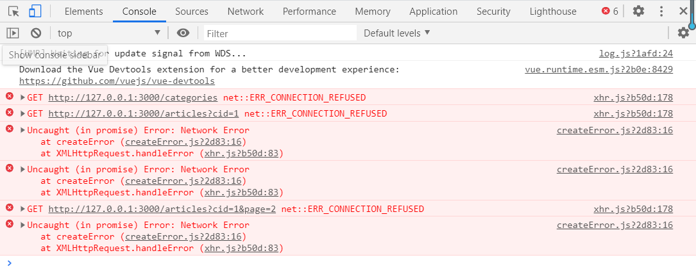

现在运行后的结果如上图所示 -- 代表`WEB`服务器挂起，原因是什么呢?

此时查看`WEB`服务器的错误信息如下图所示：

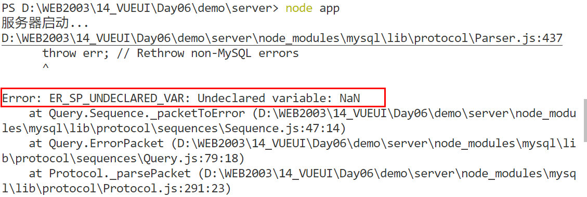

错误信息提示：未定义变量`NaN`

再仔细分析，在`JS`中产生`NaN`的情况有以下几种：

- `parseInt`
- `parseFloat`
- `Number`

再查看一下相关的服务器代码中，在哪个地方使用了如上的函数/语句，发现：

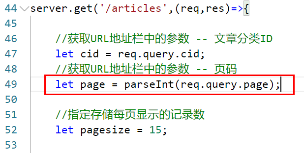

假设该`49`行语句真的得到了`NaN`，再试想一下，其中`req.query.page`来源于客户端`URL`地址栏中的请求参数，那么就也就代表有可能是因为现在没有这个参数或者这个参数的值是非法的数字字符串，如`a123`，此时再经过`parseInt`就得到了`NaN`。现在到底是哪种情况？

此时将`WEB`服务器中的相关代码进行注释，并且进行断点操作，示例如下：

```javascript

server.get('/articles',(req,res)=>{

    //获取URL地址栏中的参数 -- 文章分类ID
    let cid = req.query.cid;
    //获取URL地址栏中的参数 -- 页码
    let page = parseInt(req.query.page);

    console.log(req.query.page);
    console.log(page);
    //断点
    res.send('ok');
    // //指定存储每页显示的记录数
    // let pagesize = 15;

    // //因为分页时是利用了SELECT语句的LIMIT子句
    // //该子句中offset参数的计算公式是：
    // //(当前页码-1) * 每页显示记录数
    // //所以:
    // let offset = (page - 1) * pagesize;

    // //获取xzqa_article数据表中以获取到的cid为条件的记录
    // let sql = 'SELECT id,subject,description,image FROM xzqa_article WHERE category_id=? LIMIT ' + offset + ',' + pagesize;
    
    // //通过MySQL连接池执行SQL语句·
    // pool.query(sql,[cid],(err,results)=>{
      
    //      if(err) throw err;

    //     res.send({message:'查询成功',code:1,results:results})
    // })
});


```

此时`WEB`服务器的运行结果如下:

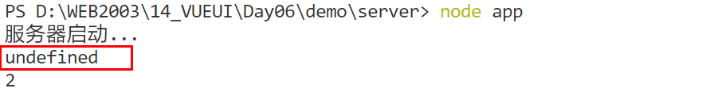

此时可以确定是由于`req.query.page`没有获取到**客户端的请求参数**导致的！ ---  修改客户端  -- 到底要修改客户端的哪一部分代码呢？

再试一下，原始的错误信息是**初始化时产生的，初始化时产生的，初始化时产生的** -- `mounted` ，此时此刻`mounted`钩子函数代码如下：

```javascript

mounted() {
    //获取文章分类数据
    this.axios.get("/categories").then(res => {
        this.categories = res.data.results;
    });

    //获取当前分类的文章数据
    this.loadData();
}

```

现在一定是在`loadData()`函数中没有向`WEB`服务器提交`page`参数，此时`loadData()`函数的代码如下：

```javascript

loadData() {
    this.axios
        .get("/articles", {
	        params: {
    	        cid: this.active
	        }
	    })
        .then(res => {
        	let data = res.data.results;
        	data.forEach(item => {
            	if (item.image != null) {
               		item.image = require("../assets/images/articles/" + item.image);
            	}
            this.articles.push(item);
        	});
	    });
}

```

原来只传递`cid`参数，而目前为了保证服务器的运行，所以必须再添加名称为`page`的参数，而且再试想 一下，无论是初始情况还是切换顶部选项卡都需要进行相同参数的传递，所以代码如下如下：

```javascript

loadData() {
    this.axios
        .get("/articles", {
        params: {
            cid: this.active,
            page:this.page
        }
    })
    .then(res => {
        let data = res.data.results;
        data.forEach(item => {
            if (item.image != null) {
                item.image = require("../assets/images/articles/" + item.image);
            }
            this.articles.push(item);
        });
    });
}

```

别忘记来启用`WEB`服务器中的相关代码，并且重启`WEB` 服务器，此时的运行效果如下所示：

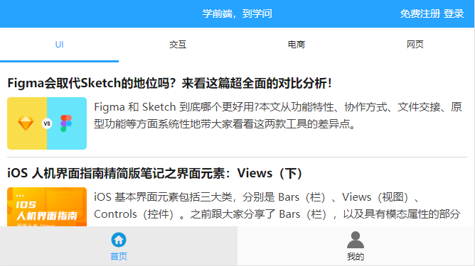

## 1.2 无限滚动及分页的实现

现在已经在相关的`HTML`元素添加了无限滚动的指令了，只是没有接收`WEB`服务器返回的结果，所以：

```javascript

loadMore(){
    this.page++;
    this.axios.get('/articles',{
        params:{
            //当前分类
            cid:this.active,
            //第几页的数据
            page:this.page
        }
    }).then(res=>{
        let data = res.data.results;
        data.forEach(item => {
            if (item.image != null) {
                item.image = require("../assets/images/articles/" + item.image);
            }
            this.articles.push(item);
        });
    });
}

```

 纵观`loadMore()`函数中代码与自定义函数`loadData()`完全相同，所以，`loadMore()`函数中只需要调用一次`loadData()`即可：

```javascript

loadMore(){
    this.page++;
    this.loadData();
}

```

如果此时切换顶部选项卡时，发生初始化数据与切换面板时数据不一致的现象！

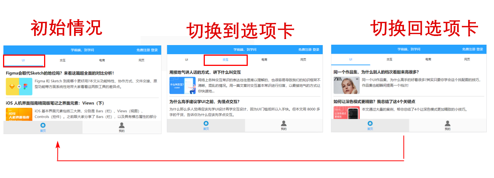

因为现在是在切换选项卡的时候产生的**逻辑错误**，只能查看控制台的相关信息了 !

在第一次切换选项卡时，控制台的`AJAX`请求如下图所示：

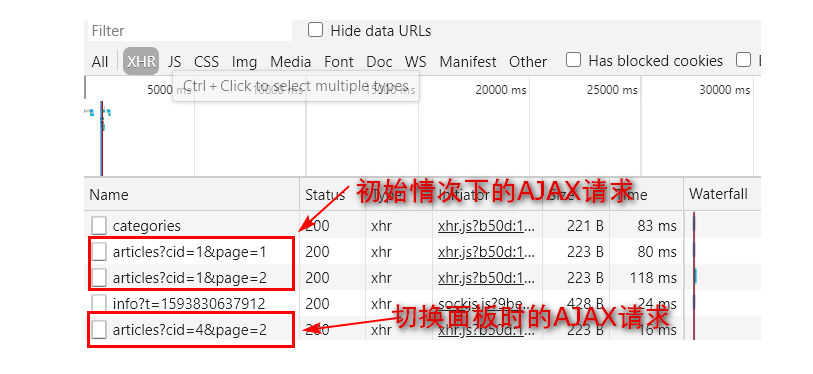

仔细分析会发现，在切换面板时，竟然请求的`page`为`2`   -- 显示是错误的，因为在切换选项卡时，应访去`WEB`服务器获取当前分类下的第一页的数据，也就是`page`只能为`1`，也就代表在切换面板时必须保证页码参数为1才行！也就意味着需要修改客户端在切换选项卡时调用的函数了 -- `watch()`,示例代码如下：

```javascript

watch: {
    active() {
        //清空之间保存的文章数据
        this.articles = [];
        //获取当前分类的文章第一页的数据      
        this.page = 1;
        this.loadData();
    }
}

```

初始情况下，`AJAX`请求的截图如下：

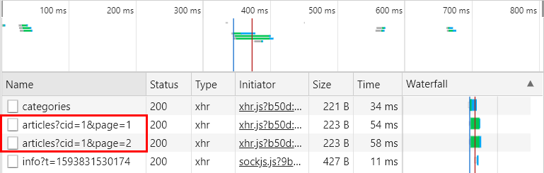

可以发现此时竟然发送了两次`AJAX`请求，怎么解决？ -- 无限滚动的`infinite-scroll-immediate-check="true"`

• 无限滚动指令

```html

<HTML元素 
	infinite-scroll-distance="阈值"
    v-infinite-scroll="方法名称"
    infinite-scroll-disabled="变量名称"
    :infinite-scroll-immediate-check="true">
</HTML元素>

```

> `infinite-scroll-distance`属性是指距滚动容器底部还有多少像素时触发无限滚动指令
>
> `v-infinite-scroll`属性用于指定在触发无限滚动指令后需要调用的方法/函数名称
>
> `infinite-scroll-disabled`属性为布尔类型，其作用是为了保证执行完上一次滚动函数之前，即使再次进行滚动范围也不再触发滚动函数。 
>
> `:infinite-scroll-immediate-check="true"` ，当无限滚动指令绑定到元素之后是否需要立即检测是否执行加载方法。在初始情况下内容较少时非常有用，但在实际使用时如果不添加该属性的话，可能会造成多发次一次`AJAX`请求。

所以需要在原来的无限滚动的元素添加该属性，示例代码如下：

```html

 <div 
	class="panel"
    infinite-scroll-distance="10"
    v-infinite-scroll="loadMore"
    infinite-scroll-disabled="busy"      
    :infinite-scroll-immediate-check="true">
	...
</div>

```

此时的运行效果如下图所示：

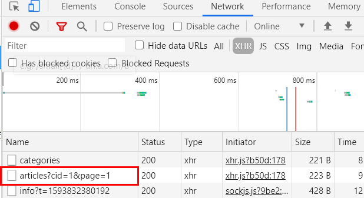


当在进行无限滚动时，因为`WEB`服务器的数据是有限的，所以可能会出现：即使已经**滚动**到该分类下的最后数据了，仍然会发送`AJAX`请求，示例图如下：

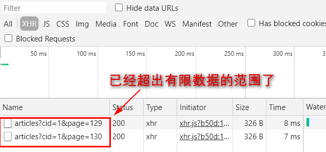

现在需要在客户端明确获知总页数，然后在向下滚动时，判断当前页码是否在总页数范围内，如果在，则继续发送`AJAX`请求，否则不发送请求了！ --  现在是客户端怎么才获知到总页数呢？

-- 所以现在要修改服务器的代码  -- 引申出如何获取总记录数? -- 回顾`MySQL`聚合函数

```mysql

-- 求最小值
MIN(字段名称)
-- 求最大值
MAX(字段名称)
-- 求平均值
AVG(字段名称)
-- 计数
COUNT(字段名称)
-- 求和
SUM(字段名称)

-- 聚合函数的特点是：只有一个返回结果
```

所以现在在`WEB`服务器的`/articles`接口中再书写`SQL`语句以获取当前分类下的文章总数，示例代码如下：

```javascript

sql = 'SELECT COUNT(id) AS count FROM xzqa_article WHERE category_id=?';

pool.query(sql,[cid],(err,record)=>{

    if(err) throws;

    console.log(record[0].count);

})

```

上述代码已经获取出总记录数，那么如何计算出总页数? -- 引申出总页数的计算公式：

```javascript

//JavaScript
Math.ceil(总记录数 / 每页显示的记录数)

```

> 友情提示：向上取整的函数在不同的编程语言中是不同的。

上述代码修改如下：

```javascript

sql = 'SELECT COUNT(id) AS count FROM xzqa_article WHERE category_id=?';

    pool.query(sql,[cid],(err,record)=>{

    if(err) throws;

    let count = record[0].count;

    console.log(Math.ceil(count / pagesize));

})

```

此时需要将页码及其他原来的数据一并返回到客户端，示例代码如下：

```javascript

server.get('/articles', (req, res) => {

    //获取URL地址栏中的参数 -- 文章分类ID
    let cid = req.query.cid;
    //获取URL地址栏中的参数 -- 页码
    let page = parseInt(req.query.page);

    // //指定存储每页显示的记录数
    let pagesize = 15;

    //因为分页时是利用了SELECT语句的LIMIT子句
    //该子句中offset参数的计算公式是：
    //(当前页码-1) * 每页显示记录数
    //所以:
    let offset = (page - 1) * pagesize;

    //获取xzqa_article数据表中以获取到的cid为条件的记录
    let sql = 'SELECT id,subject,description,image FROM xzqa_article WHERE category_id=? LIMIT ' + offset + ',' + pagesize;

    //通过MySQL连接池执行SQL语句·
    pool.query(sql, [cid], (err, results) => {

        if (err) throw err;

        //统计指定文章分类包含的文章数量
        sql = 'SELECT COUNT(id) AS count  FROM xzqa_article WHERE category_id=?';

        pool.query(sql,[cid],(err,record)=>{

            if(err) throws;
            //获取总记录数
            let count = record[0].count;
            //计算总页数
            let pagecount = Math.ceil(count / pagesize);
			//返回数据到客户端
            res.send({ message: '查询成功', code: 1, results: results,pagecount:pagecount });
        })

    })
});

```

此时的运行结果如下图所示：

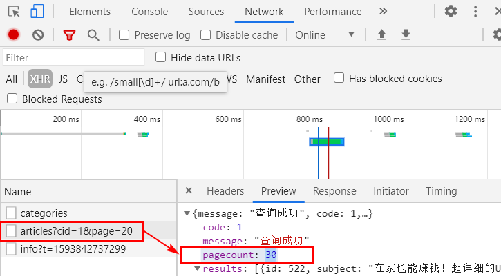

虽然`WEB`服务器现在返回了期望的数据，但是客户端还没有接收相关的数据，所以：

第一步：在`data()`中声明变量`pagecount`用于接收服务器返回的总页数，初始值可以为`0`，示例代码如下：

```javascript

data(){
	return {
		//用于存储总页数
		pagecount:0
	}
}

```

第二步，现在无论是初始情况下的`AJAX`请求，还是切换顶部选项卡的`AJAX`请求，还是无限滚动时的`ajax`请求都调用了`loadData()`函数，所以现在需要修改`loadData()`函数中的相关的代码，实现接收服务器返回信息的操作，示例代码如下：

```javascript

loadData() {
    this.axios.get("/articles", 
      {
        params: {
            //当前分类的ID
            cid: this.active,
            //当前页码
            page:this.page
        }
    })
    .then(res => {
        //接收服务器返回的文章数据
        let data = res.data.results;
        //接收服务器返回的总页数
        this.pagecount = res.data.pagecount;
        //动态加载图像
        data.forEach(item => {
            if (item.image != null) {
                item.image = require("../assets/images/articles/" + item.image);
            }
            this.articles.push(item);
        });
    });
}

```

 当客户端接收到服务器返回的数据后，就应该**在向下滚动时判断当前页码是否在总页数范围内，如果在，则继续发送`AJAX`请求，否则不进行请求的发送**，示例代码如下：

```javascript

loadMore(){
    this.page++;
    //判断当前页码是否在总页数范围内
    if(this.page <= this.pagecount){
        this.loadData();
    }
}

```

因为获取数据是客户端需要等待服务器响应，有时服务器响应速度慢，所以为了避免用户长时间面对空白页面，建议在加载数据时采用加载提示框给用户以提示，最后`loadData()`函数完整的代码如下：

```javascript

loadData() {
    //显示加载提示框
    this.$indicator.open('加载中...');
    //标识当前服务器是否正在处理相关的请求，如果在处理过程中
    //此时即使再次滚动到指定范围内也不再触发滚动函数
    this.busy = true;
    this.axios
        .get("/articles", {
        params: {
            //当前分类的ID
            cid: this.active,
            //当前页码
            page:this.page
        }
    })
    .then(res => {
        //接收服务器返回的文章数据
        let data = res.data.results;
        //接收服务器返回的总页数
        this.pagecount = res.data.pagecount;
        //动态加载图像
        data.forEach(item => {
            if (item.image != null) {
                item.image = require("../assets/images/articles/" + item.image);
            }
            this.articles.push(item);
        });
        //关闭加载提示框
        this.$indicator.close();
        //标识服务器已经响应了，如再次滚动了指定范围内可继续触发滚动函数
        this.busy = false;
    });
}

```

首页的业务功能现在已经实现了，但是在首页中应该单击文章标题或缩略图时可查看该篇文章的详细内容才行。

# 2.文章详细页面的实现

## · 创建页面组件

 在`src/views`目录下创建`Article.vue`的组件文件，示例代码如下：

```html

<template>
  <div>
  </div>
</template>

```

在`src/router/index.js`中导入页面组件并且添加路由信息，示例代码如下：

```javascript

import Article from '../views/Article.vue';
...
const routes = [
  {
    path:'/article',
    component:Article
  }
]
...

```

## · 创建链接

修改`src/views/Home.vue`，分别为文章的标题和缩略图添加`<router-link>`标签，以链接到文章详情的页面组件，示例代码如下：

```html

<!-- 标题区域开始 -->
<div class="info-item-head">
    <router-link to="/article">{{article.subject}}</router-link>
</div>
<!-- 标题区域结束 -->
<!-- 图像区域开始 -->
<div class="info-item-img" v-if="article.image != null">
    <router-link to="/article">
        
    </router-link>
</div>
<!-- 图像区域结束 -->

```

仔细试想一下，在`Article.vue`中应该显示不同文章的详细信息，如单击`1`号文章标题，则在`Article.vue`中查看`1`号文章详细信息，如单击`9`号文章标题，则在`Article.vue`中查看`9`号文章详细信息，现在问题是：在`Article.vue`中如何获知刚才单击的是第几号文章呢? -- **参数传递来实现**   -- `Vue.js`中`URL`地址栏传递的形式有：

- `/article?id=5`
- `/article/5`

**在本案例中采用第二种方式**，所以现在马上需要进行路由的修改，示例代码如下：

```javascript

const routes = [
  {
    path:'/article/:id',
    component:Article
  }
]

```

此时路由信息发生了变化，那么原来标题和缩略图的链接也必须发生相应的变化，示例代码如下：

```html

<!-- 标题区域开始 -->
<div class="info-item-head">
    <router-link :to="`/article/${article.id}`">{{article.subject}}</router-link>
</div>
<!-- 标题区域结束 -->
<!-- 图像区域开始 -->
<div class="info-item-img" v-if="article.image != null">
    <router-link :to="`/article/${article.id}`">
        
    </router-link>
</div>
<!-- 图像区域结束 -->

```

此时的运行效果如下图所示：

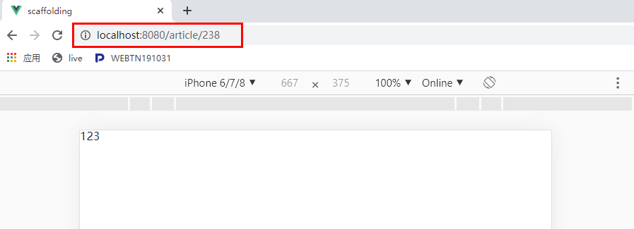

## ·  实现页面的结构布局

`Article.vue`中的示例代码如下：

```html

<template>
  <div>
    <div class="container">
      <!-- 顶部导航开始 -->
      <mt-header title="学前端，到学问">
          <router-link to="/" slot="left">
            <mt-button icon="back"></mt-button>
          </router-link>
      </mt-header>
      <!-- 顶部导航结束 -->
      <!-- 文章区域开始 -->
      <div>
        <!-- 文章头部开始 -->
        <div class="article-header">
            <div class="article-header-title">电影《我不是药神》里有哪些细思极恐的事情？</div>
        </div>
        <!-- 文章头部结束 -->
        <!-- 作者信息开始 -->
        <div></div>
        <!-- 作者信息结束 -->
        <!-- 文章正文开始 -->
        <div class="article-content">正文</div>
        <!-- 文章正文结束 -->
      </div>
      <!-- 文章区域结束 -->
    </div>
  </div>
</template>
<style scoped>
.container{
  background:#f6f6f6;
  min-height: 100vh;
}
.article-header{
  margin-bottom: 10px;
  padding: 10px;
  background:#fff;
}
.article-header-title{
  font-size:20px;
  line-height: 1.75;
  color: #1a1a1a;
}
.article-content{
  margin-top: 10px;
  font-size: 17px;
  background:#fff;
  padding:10px;
}
</style>


```

## · 初始化情况下获取相关的文章数据

初始化情况下获取相关的文章数据显示在页面组件中，引申出的问题：

```shell

1、当前浏览的文章ID如何获取？

2、在什么情况下获取文章的数据?

```

在什么情况下获取文章的数据? -- `mounted`钩子函数中发送`AJAX`请求以获取文章数据， 示例代码如下：

```javascript

mounted(){
	this.axios.get("WEB服务器API接口的地址");
}

```

当前浏览的文章`ID`如何获取？ --  `this.$route.params.参数名称`

示例代码如下：

```javascript

mounted(){
    //获取路由参数
    let id = this.$route.params.id;
	this.axios.get("/article?id=" + id);
}

```

此时运行结果如下图所示：

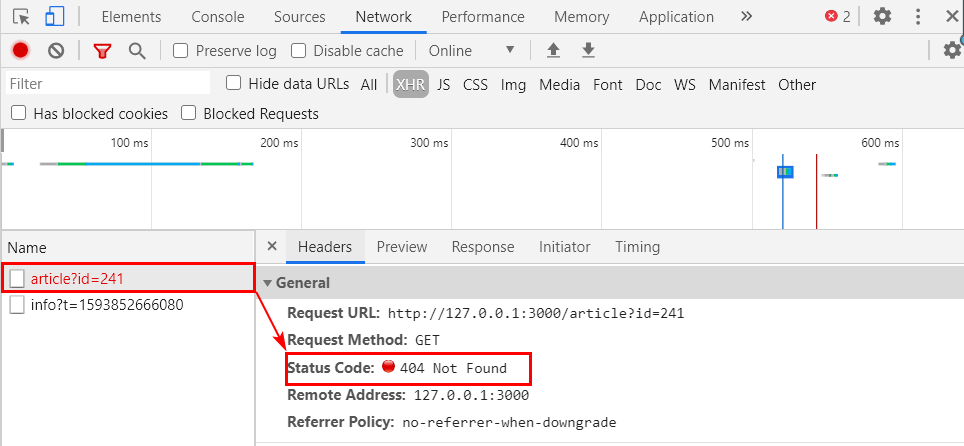

此时提示不存在对应的服务器`API`接口，所以：

## · 创建对应的服务器`API`接口

第一步：在`app.js`中， 定义`/article`的`GET`类型的接口，示例代码如下：

```javascript

server.get('/article',(req,res)=>{
    //获取URL地址栏的参数
    let id = req.query.id;
    //以id条件进行记录的查找
    let sql = 'SELECT  id,subject,content FROM xzqa_article WHERE id=?';
    //执行SQL查询
    pool.query(sql,[id],(err,results)=>{
        if(err) throw err;
        res.send({message:'查询成功',code:1,result:results[0]});
    });
});

```

第二步：重新启动`WEB`服务器

此时运行结果如下图所示：

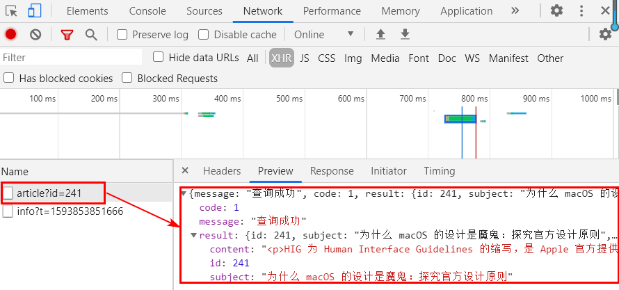

虽然现在`WEB`服务器已经成功的返回期望的数据，但是客户端现在没有接收该数据，所以：

第三步：在`Article.vue`中的`<script>`标签中书写`data()`，并且声明变量 -- `articleInfo`用于存储`WEB`服务器返回的文章信息，`articleInfo`变量的数据类型为`object`，示例代码如下：

```javascript

data(){
    return {
      //用于存储文章的信息
      articleInfo:{}
    }
}

```

第四步：修改`mounted`钩子函数中的代码，将`WEB`服务器返回的文章信息存储到`articleInfo`变量中，示例代码如下：

```javascript

 mounted(){
     let id = this.$route.params.id;    
     this.axios.get("/article?id=" + id).then(res=>{
         //将WEB服务器返回的文章信息存储到articleInfo变量中
         this.articleInfo = res.data.result;
         //console.log(this.articleInfo);
    });
  }
```

上述代码已经将`WEB`服务器返回的文章信息存储到`articleInfo`变量中，但是页面中还没有进行输出的操作，所以：

第五步：按常量说输出变量是非常简单的操作，示例代码如下：

```html

<!-- 文章头部开始 -->
<div class="article-header">
    <div class="article-header-title">{{articleInfo.subject}}</div>
</div>
<!-- 文章头部结束 -->
<!-- 文章正文开始 -->
<div class="article-content">
    {{articleInfo.content}}
</div>
<!-- 文章正文结束 -->

```

此时运行效果如下图所示：

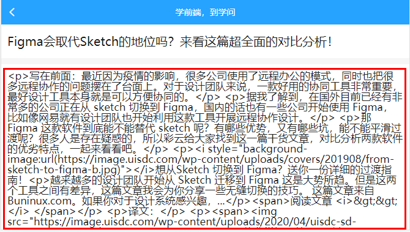

**现在可以发现：正文不是期望的结果！！！**

在`xzqa_article`(文章)数据表中，`content`字段用于存储文章的正文，而且正文中存在大量的`HTML`标记，而通过`vue.js`输出`HTML`标记时，会将其中的`<`、`>`等特殊符号替换为`HTML`实体，而现在必须作为标准的`HTML`出现，此时需要`v-html`指令！！！示例代码如下：

```html

<div class="article-content" v-html="articleInfo.content"></div>

```

另外，如果要对`v-html`指令的中内容进行`CSS`样式修饰的话，现在必须通过全局样式实现，示例代码如下:

```html

<style>
.article-content p,.article-content li{  
  padding:10px;
  line-height: 1.8em;
}
.article-content img{
  display: block;
  max-width: 100%;
}
</style>

```

此时运行效果如下图所示：

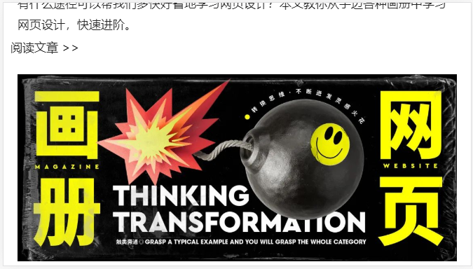

